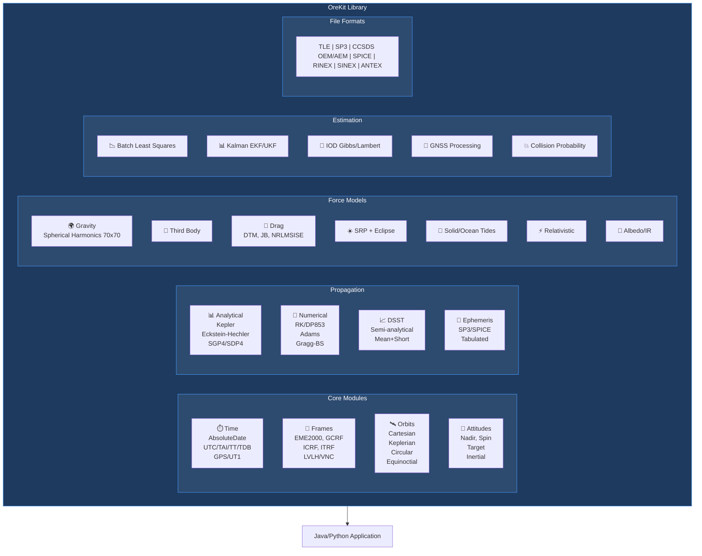
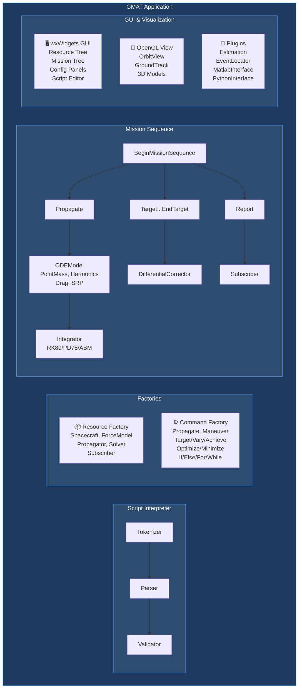
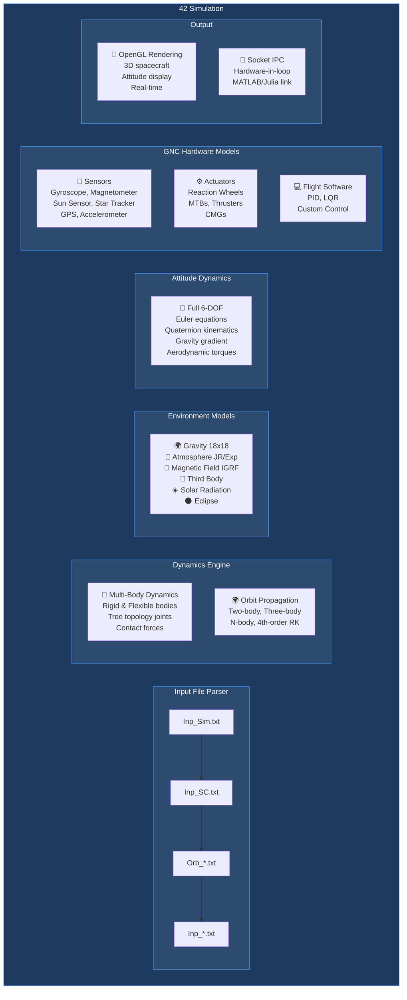
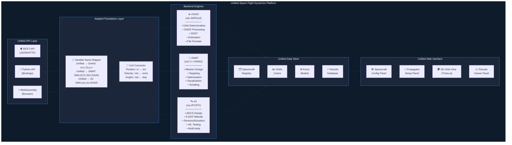
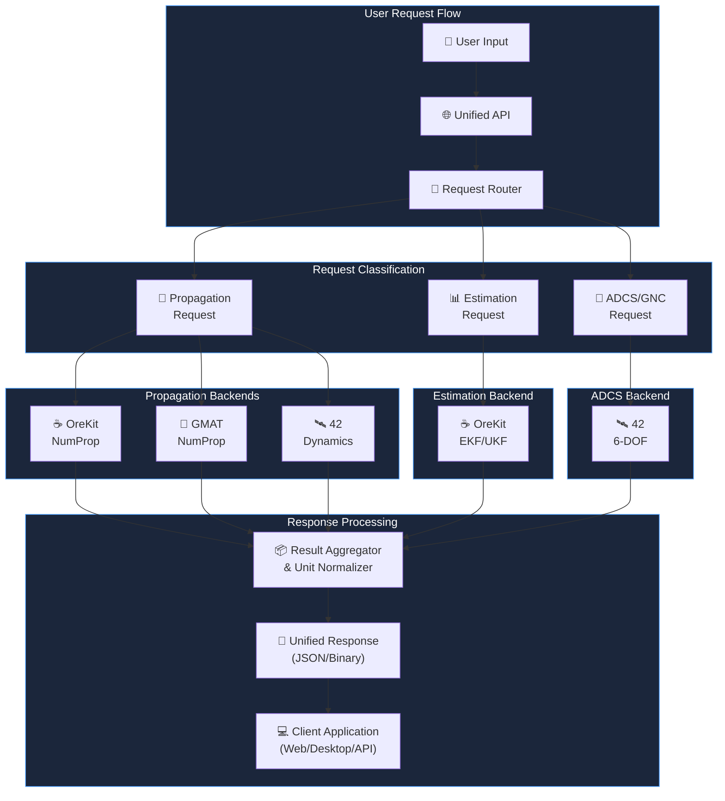

# Space Flight Dynamics Comparisons

This project aims to unify capabilities from major open-source space flight dynamics tools:
- **OreKit** - Java-based low-level library for space mechanics
- **GMAT** - NASA's General Mission Analysis Tool
- **42** - NASA Goddard's spacecraft attitude control simulation

---

## Table of Contents

1. [Feature Comparison](#feature-comparison-orekit-vs-gmat-vs-42)
2. [Source Code Analysis](#source-code-analysis)
   - [OreKit Architecture](#orekit-architecture)
   - [GMAT Architecture](#gmat-architecture)
   - [42 Architecture](#42-architecture)
3. [Architecture Diagrams](#architecture-diagrams)
4. [Unified Architecture Proposal](#unified-architecture-proposal)
5. [Variable Name Mapping](#variable-name-mapping)
6. [Implementation Roadmap](#implementation-roadmap)
7. [WebAssembly (WASM) Feasibility Analysis](#webassembly-wasm-feasibility-analysis)
   - [OreKit (Java → WebAssembly)](#orekit-java--webassembly)
   - [GMAT (C++ → WebAssembly)](#gmat-c--webassembly)
   - [42 (C → WebAssembly)](#42-c--webassembly)
8. [References](#references)

---

## Feature Comparison: OreKit vs GMAT vs 42

### 1. Propagation

| Feature | OreKit | GMAT | 42 |
|---------|--------|------|-----|
| **Numerical Integrators** | Runge-Kutta (various), Adams-Bashforth, Adams-Moulton, Dormand-Prince | Runge-Kutta, PrinceDormand45/78, Adams-Bashforth-Moulton, Bulirsch-Stoer | 4th-order Runge-Kutta |
| **Analytical Propagators** | Kepler, Brouwer-Lyddane, Eckstein-Hechler | Keplerian (two-body) | Two-body, Three-body |
| **SGP4/SDP4 (TLE)** | ✅ Full support + TLE generation | ✅ TLE propagation (R2022a+) | ❌ |
| **DSST (Semi-analytical)** | ✅ Draper Semi-analytical Satellite Theory | ❌ | ❌ |
| **Ephemeris Propagation** | ✅ SP3, SPICE, tabulated | ✅ SPICE, Code500 ephemeris | ✅ Meeus algorithms |
| **Multi-spacecraft** | ✅ Parallel propagation | ✅ Coupled dynamics, synchronized epochs | ✅ Concurrent multi-spacecraft |
| **CR3BP/Libration Points** | ✅ Halo orbit propagation | ✅ Libration point missions | ✅ Three-body orbits |
| **Flexible Body Dynamics** | ❌ | ❌ | ✅ Rigid and flexible bodies |
| **Multi-body Dynamics** | ❌ | ❌ | ✅ Tree topology joints |

### 2. Force Models

| Feature | OreKit | GMAT | 42 |
|---------|--------|------|-----|
| **Gravity (Point Mass)** | ✅ | ✅ | ✅ |
| **Gravity (Spherical Harmonics)** | ✅ ICGEM, EGM, SHA formats | ✅ COF, GRV, GFC, TAB formats | ✅ EGM96 (Earth), GMM-2B (Mars), GLGM2 (Luna) up to 18x18 |
| **Max Gravity Degree/Order** | Configurable (70x70+) | Configurable (70x70+) | 18x18 |
| **Third Body** | ✅ Sun, Moon, planets | ✅ Sun, Moon, planets | ✅ All planets and major moons |
| **Atmospheric Drag** | ✅ DTM2000, JB2006/2008, NRLMSISE-00, Harris-Priester | ✅ Jacchia-Roberts, MSISE90, JB2008 | ✅ Jacchia-Roberts (Earth), Exponential (Mars) |
| **Solar Radiation Pressure** | ✅ With eclipse modeling | ✅ Basic + N-plate SRP (R2022a+) | ✅ |
| **Solid Tides** | ✅ | ✅ | ❌ |
| **Ocean Tides** | ✅ | ✅ | ❌ |
| **Relativistic Corrections** | ✅ General relativistic effects | ✅ | ❌ |
| **Albedo/IR Radiation** | ✅ Earth albedo and infrared | ❌ | ❌ |
| **Gravity Gradient Torque** | ✅ | ✅ | ✅ |
| **Aerodynamic Torque** | ❌ | ❌ | ✅ |
| **Magnetic Field** | ✅ WMM, IGRF | ❌ | ✅ Planetary magnetic field models |
| **Contact Forces** | ❌ | ❌ | ✅ Spacecraft-surface contact |

### 3. Coordinate Systems & Frames

| Feature | OreKit | GMAT | 42 |
|---------|--------|------|-----|
| **Inertial Frames** | EME2000, GCRF, ICRF, MOD, TOD, TEME | MJ2000Eq, MJ2000Ec, ICRF | J2000, Heliocentric |
| **Earth-Fixed** | ITRF (multiple versions), TIRF | BodyFixed, BodyInertial | Body-fixed for any body |
| **Local Orbital Frames** | LVLH, VNC, TNW, QSW | VNB, LVLH | LVLH, body frames |
| **Body-Centered** | Any celestial body | Earth, Moon, Sun, planets | All solar system bodies |
| **Topocentric** | ✅ Ground station frames | ✅ | ✅ |
| **Barycentric** | ✅ Solar system barycenter | ✅ | ✅ |
| **Libration Point Frames** | ✅ L1-L5 for any system | ✅ | ✅ |
| **User-Defined Frames** | ✅ Hierarchical frame trees | ✅ | ✅ |

### 4. Orbit Representation

| Feature | OreKit | GMAT | 42 |
|---------|--------|------|-----|
| **Cartesian** | ✅ Position/Velocity | ✅ X, Y, Z, VX, VY, VZ | ✅ |
| **Keplerian** | ✅ a, e, i, Ω, ω, ν/M/E | ✅ SMA, ECC, INC, RAAN, AOP, TA/MA | ✅ |
| **Circular** | ✅ For near-circular orbits | ❌ | ❌ |
| **Equinoctial** | ✅ Singularity-free | ✅ ModifiedEquinoctial | ❌ |
| **Spherical** | ❌ | ✅ RMAG, RA, DEC, VMAG, AZI, FPA | ❌ |
| **Two-Line Elements** | ✅ Parse and generate | ✅ Parse and propagate | ❌ |

### 5. Time Systems

| Feature | OreKit | GMAT | 42 |
|---------|--------|------|-----|
| **UTC** | ✅ With leap seconds | ✅ UTCGregorian, UTCModJulian | ✅ |
| **TAI** | ✅ | ✅ TAIGregorian, TAIModJulian | ❌ |
| **TT (Terrestrial Time)** | ✅ | ✅ TTGregorian, TTModJulian | ✅ |
| **TDB (Barycentric)** | ✅ | ✅ TDBGregorian, TDBModJulian | ✅ |
| **GPS Time** | ✅ | ✅ | ✅ |
| **UT1** | ✅ | ❌ | ❌ |
| **Julian Date** | ✅ | ✅ | ✅ |

### 6. Maneuvers

| Feature | OreKit | GMAT | 42 |
|---------|--------|------|-----|
| **Impulsive Burns** | ✅ | ✅ ImpulsiveBurn | ✅ |
| **Finite Burns** | ✅ Continuous thrust | ✅ FiniteBurn with thruster models | ✅ Thruster models |
| **Low-Thrust** | ✅ | ✅ | ✅ |
| **Propulsion Modeling** | ✅ User-defined | ✅ Tanks, Thrusters, ISP, thrust curves | ✅ Thrusters with fuel consumption |
| **Mass Decrement** | ✅ | ✅ | ✅ |
| **Thrust Direction** | ✅ Any frame | ✅ VNB, Body-fixed, inertial | ✅ Body-fixed |
| **Maneuver Triggers** | ✅ Event-based | ✅ Command-based | ✅ Flight software control |

### 7. Solvers & Optimization

| Feature | OreKit | GMAT | 42 |
|---------|--------|------|-----|
| **Differential Corrector** | ❌ (use external) | ✅ Newton-Raphson, Broyden, Modified Broyden | ❌ |
| **Batch Least Squares** | ✅ Levenberg-Marquardt, Gauss-Newton | ✅ Batch Estimator | ❌ |
| **Kalman Filters** | ✅ EKF, UKF, Semi-analytical | ✅ Extended Kalman Filter | ❌ |
| **Smoother** | ✅ RTS smoother | ✅ EKF Smoother (R2022a+) | ❌ |
| **Nonlinear Programming** | ❌ | ✅ VF13ad (SQP), fmincon (MATLAB) | ❌ |
| **Targeting** | ❌ | ✅ Target/Vary/Achieve commands | ❌ |
| **Trajectory Optimization** | ✅ Pontryagin/indirect methods | ✅ Optimize/Minimize commands | ❌ |

### 8. Event Detection

| Feature | OreKit | GMAT | 42 |
|---------|--------|------|-----|
| **Eclipse (Umbra/Penumbra)** | ✅ | ✅ EclipseLocator | ✅ |
| **Ground Station Visibility** | ✅ | ✅ ContactLocator | ✅ |
| **Apogee/Perigee** | ✅ | ✅ Periapsis/Apoapsis stop conditions | ✅ |
| **Node Crossings** | ✅ Ascending/Descending | ✅ | ❌ |
| **Altitude Crossing** | ✅ | ✅ | ❌ |
| **Inter-satellite LOS** | ✅ | ✅ | ✅ |
| **Angular Separation** | ✅ | ✅ | ❌ |
| **Surface Contact** | ❌ | ❌ | ✅ Lander/rover contact |

### 9. Orbit Determination

| Feature | OreKit | GMAT | 42 |
|---------|--------|------|-----|
| **Initial Orbit Determination** | ✅ Gibbs, Herrick-Gibbs, Gooding, Lambert, Gauss, Laplace | ✅ IOD capability (R2022a+) | ❌ |
| **Range Measurements** | ✅ One-way, two-way, TDRSS | ✅ | ❌ |
| **Range-Rate (Doppler)** | ✅ | ✅ | ❌ |
| **Angles (Az/El, RA/Dec)** | ✅ | ✅ | ❌ |
| **GNSS Measurements** | ✅ Code, carrier phase, ambiguity resolution | ❌ Limited | ✅ GPS receiver model |
| **TDOA/FDOA** | ✅ | ❌ | ❌ |
| **Covariance Propagation** | ✅ | ✅ (R2022a+) | ❌ |

### 10. Spacecraft Modeling

| Feature | OreKit | GMAT | 42 |
|---------|--------|------|-----|
| **Mass Properties** | ✅ Dry mass, fuel mass | ✅ DryMass, FuelMass | ✅ Mass, inertia tensor |
| **Drag Properties** | ✅ Cd, drag area | ✅ Cd, DragArea | ✅ Cd, drag area |
| **SRP Properties** | ✅ Cr, SRP area | ✅ Cr, SRPArea | ✅ Cr, SRP area |
| **Tanks** | ✅ Basic | ✅ ChemicalTank, ElectricTank | ✅ |
| **Thrusters** | ✅ Basic | ✅ ChemicalThruster, ElectricThruster | ✅ Multiple thruster types |
| **Power Systems** | ❌ | ✅ SolarPowerSystem, NuclearPowerSystem | ❌ |
| **Flexible Bodies** | ❌ | ❌ | ✅ Modal analysis |
| **Multi-body Joints** | ❌ | ❌ | ✅ Rotational/translational joints |
| **Formations** | ✅ Walker constellations | ✅ Formation object | ✅ Parent-child, peer-to-peer |

### 11. Attitude

| Feature | OreKit | GMAT | 42 |
|---------|--------|------|-----|
| **Attitude Dynamics** | ✅ Kinematic only | ✅ Limited | ✅ Full 6-DOF dynamics |
| **Attitude Laws** | ✅ Nadir, target tracking, yaw compensation, spin, inertial | ✅ CoordinateSystemFixed, Spinner, NadirPointing | ✅ Multiple pointing modes |
| **Euler Angles** | ✅ | ✅ All 12 sequences | ✅ |
| **Quaternions** | ✅ | ✅ | ✅ |
| **Direction Cosine Matrix** | ✅ | ✅ | ✅ |
| **Modified Rodrigues** | ❌ | ✅ | ❌ |
| **Attitude Control Laws** | ❌ | ❌ | ✅ PID, LQR, custom |
| **GNSS-Specific Attitudes** | ✅ GPS, GLONASS, Galileo, Beidou | ❌ | ❌ |

### 12. Sensors & Actuators (GNC Hardware)

| Feature | OreKit | GMAT | 42 |
|---------|--------|------|-----|
| **Gyroscopes** | ❌ | ❌ | ✅ With noise models |
| **Magnetometers** | ❌ | ❌ | ✅ 3-axis |
| **Sun Sensors** | ❌ | ❌ | ✅ Coarse and fine |
| **Star Trackers** | ❌ | ❌ | ✅ With noise models |
| **GPS Receivers** | ✅ Measurement modeling | ❌ | ✅ Position/velocity |
| **Accelerometers** | ❌ | ❌ | ✅ |
| **Reaction Wheels** | ❌ | ❌ | ✅ With momentum management |
| **Magnetic Torquers** | ❌ | ❌ | ✅ |
| **Control Moment Gyros** | ❌ | ❌ | ✅ |
| **Thrusters (ACS)** | ✅ | ✅ | ✅ |

### 13. File Formats

| Feature | OreKit | GMAT | 42 |
|---------|--------|------|-----|
| **TLE** | ✅ Read/Write | ✅ Read | ❌ |
| **SP3** | ✅ versions a-d | ❌ | ❌ |
| **CCSDS OEM** | ✅ | ✅ | ❌ |
| **CCSDS AEM** | ✅ | ✅ | ❌ |
| **SPICE SPK** | ✅ DE4xx, INPOP | ✅ | ❌ |
| **RINEX** | ✅ v2, v3, v4 | ❌ | ❌ |
| **Plain Text Config** | ❌ | ✅ Script files | ✅ Input files |
| **Socket IPC** | ❌ | ❌ | ✅ External app interface |

### 14. Visualization & Output

| Feature | OreKit | GMAT | 42 |
|---------|--------|------|-----|
| **3D Orbit View** | ❌ (external tools) | ✅ OrbitView with OpenGL | ✅ OpenGL visualization |
| **Spacecraft 3D Model** | ❌ | ✅ | ✅ Attitude visualization |
| **Ground Track Plot** | ❌ | ✅ GroundTrackPlot | ❌ |
| **XY Plots** | ❌ | ✅ XYPlot | ❌ |
| **Report Files** | ❌ | ✅ ReportFile | ✅ Text output |
| **Real-time Display** | ❌ | ❌ | ✅ |

### 15. Scripting & Integration

| Feature | OreKit | GMAT | 42 |
|---------|--------|------|-----|
| **Native Language** | Java | C++ | C |
| **Script Interface** | ❌ (API only) | ✅ MATLAB-like script language | ✅ Text input files |
| **GUI** | ❌ | ✅ Full GUI | ✅ OpenGL visualization |
| **Python Bindings** | ✅ via JCC or Orekit-Python wrapper | ✅ via SWIG (experimental) | ❌ |
| **MATLAB Integration** | ❌ | ✅ Native MATLAB function calls | ✅ MATLAB support |
| **Socket IPC** | ❌ | ❌ | ✅ Hardware-in-the-loop |
| **Julia Support** | ❌ | ❌ | ✅ |

### 16. Special Capabilities

| Feature | OreKit | GMAT | 42 |
|---------|--------|------|-----|
| **Collision Probability** | ✅ Multiple methods (Chan, Alfriend, Alfano, Patera) | ❌ | ❌ |
| **GNSS Multi-Constellation** | ✅ GPS, GLONASS, Galileo, Beidou, NavIC, QZSS | ❌ | ❌ |
| **Dilution of Precision** | ✅ GDOP, PDOP, TDOP | ❌ | ❌ |
| **Mission Sequence** | ❌ | ✅ Full mission scripting with control flow | ❌ |
| **Targeting Loops** | ❌ | ✅ Target/Vary/Achieve | ❌ |
| **Proximity Operations** | ❌ | ✅ | ✅ Rendezvous, servicing |
| **Formation Flying** | ✅ | ✅ | ✅ Precision formation |
| **Lander/Rover Ops** | ❌ | ❌ | ✅ Surface contact dynamics |
| **Flight Software Testing** | ❌ | ❌ | ✅ GNC algorithm validation |
| **Hardware-in-the-Loop** | ❌ | ❌ | ✅ Socket IPC |

---

## Summary Comparison

| Aspect | OreKit | GMAT | 42 |
|--------|--------|------|-----|
| **Primary Purpose** | Orbit determination, GNSS, precision ephemeris | Mission design, trajectory optimization | Attitude control system design & test |
| **Architecture** | Low-level library (Java) | Complete application (C++ with GUI/Script) | Simulation framework (C) |
| **Best For** | Library integration, OD, GNSS processing | Mission planning, visualization, analysis | GNC design, ADCS validation, HIL testing |
| **Propagation** | Many analytical options, DSST | Multi-spacecraft synchronization | Multi-body dynamics |
| **Force Models** | Most complete (albedo, tides, etc.) | Good coverage, simpler config | Attitude-relevant forces |
| **Attitude** | Kinematic only | Basic modeling | Full 6-DOF dynamics with sensors/actuators |
| **Sensors/Actuators** | None | None | Comprehensive GNC hardware models |
| **Estimation** | Superior GNSS support, IOD | Integrated targeting | None |
| **Solvers** | External optimization | Built-in DC, NLP, targeting | None |
| **Visualization** | None (external) | Integrated 3D/2D plotting | Real-time 3D attitude display |
| **Learning Curve** | Steeper (API-based) | Moderate (GUI + script) | Moderate (config files) |
| **Use Case** | Flight dynamics, navigation | Mission analysis | ADCS development |

---

## Variable Name Mapping

### Orbital Elements

| Concept | OreKit | GMAT | 42 | SFDaaS |
|---------|--------|------|-----|--------|
| Semi-major axis | `a` | `SMA` | `SMA` | N/A (Cartesian) |
| Eccentricity | `e` | `ECC` | `ecc` | N/A |
| Inclination | `i` | `INC` | `inc` | N/A |
| RAAN | `Ω` (omega) | `RAAN` | `RAAN` | N/A |
| Arg of Periapsis | `ω` (smallOmega) | `AOP` | `ArgP` | N/A |
| True Anomaly | `ν` (nu) | `TA` | `anom` | N/A |
| Mean Anomaly | `M` | `MA` | `MeanAnom` | N/A |
| Position X | `position.getX()` | `X` | `PosN[0]` | `r0[0]` |
| Position Y | `position.getY()` | `Y` | `PosN[1]` | `r0[1]` |
| Position Z | `position.getZ()` | `Z` | `PosN[2]` | `r0[2]` |
| Velocity X | `velocity.getX()` | `VX` | `VelN[0]` | `v0[0]` |
| Velocity Y | `velocity.getY()` | `VY` | `VelN[1]` | `v0[1]` |
| Velocity Z | `velocity.getZ()` | `VZ` | `VelN[2]` | `v0[2]` |

### Propagation Parameters

| Concept | OreKit | GMAT | 42 | SFDaaS |
|---------|--------|------|-----|--------|
| Step size | `stepSize` | `InitialStepSize` | `DT` | `stepSize` |
| Min step | `minStep` | `MinStep` | N/A | `minStep` |
| Max step | `maxStep` | `MaxStep` | N/A | `maxStep` |
| Position tolerance | `positionTolerance` | (part of `Accuracy`) | N/A | `positionTolerance` |
| Velocity tolerance | `velocityTolerance` | (part of `Accuracy`) | N/A | `velocityTolerance` |

### Integrator Types

| Description | OreKit | GMAT | 42 | SFDaaS |
|-------------|--------|------|-----|--------|
| Runge-Kutta 4th order | `ClassicalRungeKuttaIntegrator` | N/A | ✅ (default) | `rungekutta` |
| Runge-Kutta 8/9 | N/A | `RungeKutta89` | N/A | N/A |
| Dormand-Prince 8(5,3) | `DormandPrince853Integrator` | `PrinceDormand78` | N/A | `dormandprince` |
| Adams-Bashforth | `AdamsBashforthIntegrator` | `AdamsBashforthMoulton` | N/A | `adamsbashforth` |
| Adams-Moulton | `AdamsMoultonIntegrator` | (combined above) | N/A | `adamsmoulton` |

### Reference Frames

| Description | OreKit | GMAT | 42 | SFDaaS |
|-------------|--------|------|-----|--------|
| J2000 Equatorial | `FramesFactory.getEME2000()` | `EarthMJ2000Eq` | `J` frame | `eme2000` |
| J2000 Ecliptic | N/A | `EarthMJ2000Ec` | `H` frame | N/A |
| GCRF/ICRF | `FramesFactory.getGCRF()` | `EarthICRF` | N/A | `gcrf` |
| Earth-Fixed | `FramesFactory.getITRF()` | `EarthFixed` | `W` frame | `itrf` |
| Body Frame | N/A | N/A | `B` frame | N/A |
| LVLH | `LOFType.LVLH` | `LVLH` | `L` frame | N/A |

### Spacecraft Properties

| Concept | OreKit | GMAT | 42 | SFDaaS |
|---------|--------|------|-----|--------|
| Dry Mass | `SpacecraftState.getMass()` | `DryMass` | `mass` | N/A |
| Drag Coefficient | `IsotropicDrag.getCd()` | `Cd` | `Cd` | N/A |
| Reflectivity Coeff | `IsotropicRadiationSingleCoefficient.getCr()` | `Cr` | `Cr` | N/A |
| Drag Area | `IsotropicDrag.getCrossSection()` | `DragArea` | `DragArea` | N/A |
| SRP Area | `IsotropicRadiationSingleCoefficient.getCrossSection()` | `SRPArea` | `SRPArea` | N/A |
| Inertia Tensor | N/A | N/A | `I` (3x3) | N/A |

### Attitude Representations

| Concept | OreKit | GMAT | 42 |
|---------|--------|------|-----|
| Quaternion | `Rotation.getQ0/Q1/Q2/Q3()` | `Q1, Q2, Q3, Q4` | `q` (4-vector) |
| Euler Angles | `Rotation.getAngles()` | `EulerAngle1/2/3` | `Ang` (3-vector) |
| DCM | `Rotation.getMatrix()` | `DCM11...DCM33` | `C` (3x3) |
| Angular Velocity | `AngularCoordinates.getRotationRate()` | `EulerAngleRate1/2/3` | `wbn` (3-vector) |

### Sensors (42)

| Sensor Type | 42 Variable | Description |
|-------------|-------------|-------------|
| Gyroscope | `Gyro` | Angular rate sensor |
| Magnetometer | `MAG` | Magnetic field sensor |
| Sun Sensor | `CSS`, `FSS` | Coarse/Fine sun sensors |
| Star Tracker | `ST` | Star tracker |
| GPS Receiver | `GPS` | Position/velocity |
| Accelerometer | `Accel` | Linear acceleration |

### Actuators (42)

| Actuator Type | 42 Variable | Description |
|---------------|-------------|-------------|
| Reaction Wheel | `Whl` | Momentum wheel |
| Magnetic Torquer | `MTB` | Magnetic torque rod |
| Thruster | `Thr` | Thruster |
| Control Moment Gyro | `CMG` | CMG |

---

## Gravitational Parameters (μ in m³/s²)

| Body | OreKit | GMAT | 42 | SFDaaS |
|------|--------|------|-----|--------|
| Earth | `Constants.EGM96_EARTH_MU` (3.986004415e14) | 3.986004418e14 | 3.986004418e14 | 3.986004418e14 |
| Sun | `Constants.JPL_SSD_SUN_GM` | 1.32712440018e20 | 1.32712440018e20 | 1.32712440018e20 |
| Moon | `Constants.JPL_SSD_MOON_GM` | 4.9028e12 | 4.9028e12 | 4.9028e12 |
| Mars | via CelestialBodyFactory | 4.282837e13 | 4.282837e13 | 4.282837e13 |
| Jupiter | via CelestialBodyFactory | 1.26686534e17 | 1.26686534e17 | 1.26686534e17 |

---

## Default Values Comparison

### Propagator Defaults

| Parameter | OreKit | GMAT | 42 | SFDaaS |
|-----------|--------|------|-----|--------|
| Step Size | User-defined | 60 s | User-defined | 60 s |
| Min Step | User-defined | 0.001 s | N/A | 0.001 s |
| Max Step | User-defined | 2700 s | N/A | 1000 s |
| Position Tolerance | User-defined | (via Accuracy) | N/A | 10 m |
| Velocity Tolerance | User-defined | (via Accuracy) | N/A | 0.01 m/s |

### Force Model Defaults

| Property | OreKit | GMAT | 42 |
|----------|--------|------|-----|
| Central Body | User-defined | Earth | Earth |
| Gravity Degree | User-defined | 4 | 18 |
| Gravity Order | User-defined | 4 | 18 |
| Gravity Model | User-defined | JGM2 | EGM96 |
| Atmospheric Model | User-defined | Jacchia-Roberts | Jacchia-Roberts |
| Magnetic Field | IGRF/WMM | N/A | IGRF |

---

## References

- [OreKit 13.1.3 API Documentation](https://www.orekit.org/site-orekit-13.1.3/apidocs/index.html)
- [NASA GMAT Software Catalog](https://software.nasa.gov/software/GSC-19097-1)
- [GMAT Wiki](https://gmat.atlassian.net/wiki/spaces/GW/overview)
- [42 GitHub Repository](https://github.com/ericstoneking/42)
- [42 NASA Software Catalog](https://software.nasa.gov/software/GSC-16720-1)
- [42 Introduction to Simulation (PDF)](https://granasat.ugr.es/wp-content/uploads/2019/02/42-Intro-to-Simulation.pdf)
- [42 NASA Technical Report](https://ntrs.nasa.gov/citations/20180000954)

---

## Source Code Analysis

### OreKit Architecture

**Repository:** [GitLab](https://gitlab.orekit.org/orekit/orekit) | [GitHub Mirror](https://github.com/CS-SI/Orekit)
**Language:** Java (100%)
**License:** Apache 2.0
**Latest Version:** 13.1.3
**Lines of Code:** ~500,000+

#### Design Philosophy

OreKit was designed with four key goals:
1. **User-extensible** through clear, simple architecture
2. **Unified interfaces** allowing models and algorithms to be switched with minimal effort
3. **Pluggable models** (basic and rich) that can be interchanged for validation
4. **Separation of concerns** - model configuration hidden from usage

#### Package Structure

```
org.orekit/
├── annotation/          # Custom annotations
├── attitudes/           # Attitude laws (nadir, spin, target tracking)
├── bodies/              # Celestial bodies, ellipsoids, ground points
├── data/                # Data loading (IERS, leap seconds, gravity)
├── errors/              # Exception handling
├── estimation/          # Orbit determination (batch, Kalman, IOD)
│   ├── iod/            # Initial orbit determination (Gibbs, Lambert, Gauss)
│   ├── leastsquares/   # Batch least squares estimation
│   ├── measurements/   # Range, Doppler, angles, GNSS
│   └── sequential/     # Kalman filters (EKF, UKF)
├── files/               # File format parsers
│   ├── ccsds/          # CCSDS OEM, AEM, TDM, CDM
│   ├── general/        # Generic parsers
│   ├── rinex/          # RINEX 2/3/4
│   ├── sinex/          # SINEX format
│   └── sp3/            # SP3 precise ephemeris
├── forces/              # Force models
│   ├── drag/           # Atmospheric drag (DTM, JB, NRLMSISE)
│   ├── empirical/      # Empirical accelerations
│   ├── gravity/        # Gravity (spherical harmonics, 3rd body)
│   ├── inertia/        # Inertia-related forces
│   ├── maneuvers/      # Impulsive and continuous thrust
│   ├── radiation/      # SRP, albedo, infrared
│   └── ForceModel.java # Base interface
├── frames/              # Reference frames
│   ├── FramesFactory    # EME2000, GCRF, ITRF, TEME, MOD, TOD
│   ├── Transform        # Frame transformations
│   └── LOFType          # Local orbital frames (LVLH, VNC, TNW)
├── gnss/                # GNSS processing
│   ├── attitude/       # GNSS-specific attitudes
│   ├── metric/         # DOP calculations
│   └── antenna/        # Antenna models
├── models/              # Physical models
│   ├── earth/          # Earth models (atmosphere, geoid, tides)
│   └── AtmosphericRefractionModel
├── orbits/              # Orbit representations
│   ├── CartesianOrbit   # Position/velocity
│   ├── KeplerianOrbit   # Classical elements (a, e, i, Ω, ω, ν)
│   ├── CircularOrbit    # Near-circular orbits
│   ├── EquinoctialOrbit # Singularity-free
│   └── Orbit            # Abstract base class
├── propagation/         # Propagators
│   ├── analytical/     # Kepler, Eckstein-Hechler, SGP4/SDP4
│   ├── conversion/     # Osculating ↔ mean conversion
│   ├── events/         # Event detection
│   ├── integration/    # ODE integrators
│   ├── numerical/      # Numerical propagation
│   ├── semianalytical/ # DSST (Draper Semi-analytical)
│   ├── Propagator       # Base interface
│   └── SpacecraftState  # Complete state container
├── ssa/                 # Space situational awareness
│   └── collision/      # Collision probability (Chan, Alfriend, Alfano)
├── time/                # Time systems
│   ├── AbsoluteDate     # Epoch representation
│   ├── TimeScale        # UTC, TAI, TT, TDB, GPS, UT1
│   └── TimeScalesFactory
└── utils/               # Utilities (constants, interpolation, math)
```

#### Key Class Hierarchy

```
Propagator (interface)
├── AbstractPropagator
│   ├── AbstractAnalyticalPropagator
│   │   ├── KeplerianPropagator
│   │   ├── EcksteinHechlerPropagator
│   │   ├── BrouwerLyddanePropagator
│   │   └── TLEPropagator (SGP4/SDP4)
│   ├── AbstractIntegratedPropagator
│   │   ├── NumericalPropagator
│   │   └── DSSTPropagator
│   └── EphemerisGenerator

Orbit (abstract)
├── CartesianOrbit
├── KeplerianOrbit
├── CircularOrbit
└── EquinoctialOrbit

ForceModel (interface)
├── HolmesFeatherstoneAttractionModel  # Spherical harmonics gravity
├── ThirdBodyAttraction                 # Point-mass 3rd body
├── IsotropicDrag                       # Atmospheric drag
├── SolarRadiationPressure             # SRP with eclipse
├── SolidTides                         # Solid Earth tides
├── OceanTides                         # Ocean tides
└── Maneuver                           # Thrust maneuvers
```

#### Integration Pattern

```java
// OreKit propagation example
Frame inertialFrame = FramesFactory.getEME2000();
TimeScale utc = TimeScalesFactory.getUTC();
AbsoluteDate initialDate = new AbsoluteDate(2024, 1, 1, 0, 0, 0.0, utc);

// Define orbit
Orbit initialOrbit = new KeplerianOrbit(
    7000000.0,           // a (m)
    0.001,               // e
    Math.toRadians(98),  // i
    Math.toRadians(0),   // Ω
    Math.toRadians(0),   // ω
    Math.toRadians(0),   // ν
    PositionAngleType.TRUE,
    inertialFrame,
    initialDate,
    Constants.EGM96_EARTH_MU
);

// Configure propagator
NumericalPropagator propagator = new NumericalPropagator(
    new DormandPrince853Integrator(0.001, 1000, 1e-10, 1e-10)
);
propagator.setInitialState(new SpacecraftState(initialOrbit));
propagator.addForceModel(new HolmesFeatherstoneAttractionModel(
    FramesFactory.getITRF(IERSConventions.IERS_2010, true),
    GravityFieldFactory.getNormalizedProvider(70, 70)
));

// Propagate
SpacecraftState finalState = propagator.propagate(initialDate.shiftedBy(86400));
```

---

### GMAT Architecture

**Repository:** [SourceForge](https://sourceforge.net/projects/gmat/) | [GitHub Fork](https://github.com/ChristopherRabotin/GMAT)
**Language:** C++ (66.5%), with Fortran, Python, HTML
**License:** Apache 2.0
**Latest Version:** R2025a
**Lines of Code:** ~2,000,000

#### Design Philosophy

GMAT uses an **Object-Oriented methodology** with a rich class structure designed to make new features simple to incorporate. The architecture models spacecraft missions by specializing high-level abstract classes into detailed simulation elements.

#### Directory Structure

```
GMAT/
├── application/         # Runtime application files
│   ├── bin/            # Executables
│   ├── data/           # Data files (gravity, ephemeris, leap seconds)
│   ├── matlab/         # MATLAB interfaces
│   ├── plugins/        # Runtime plugins
│   └── userfunctions/  # User-defined functions
├── build/               # Build configuration and outputs
├── depends/             # External dependencies
│   ├── cspice/         # NASA SPICE toolkit
│   ├── f2c/            # Fortran to C converter
│   ├── pcrecpp/        # Regular expressions
│   ├── wxWidgets/      # GUI framework
│   └── xerces/         # XML parser
├── plugins/             # Plugin source code
│   ├── CInterfacePlugin/
│   ├── DataInterfacePlugin/
│   ├── EphemPropagatorPlugin/
│   ├── EstimationPlugin/
│   ├── EventLocatorPlugin/
│   ├── ExtraPropagatorsPlugin/
│   ├── FormationPlugin/
│   ├── GmatFunctionPlugin/
│   ├── MatlabInterfacePlugin/
│   ├── PolyhedronGravityPlugin/
│   ├── PythonInterfacePlugin/
│   ├── SaveCommandPlugin/
│   ├── ScriptToolsPlugin/
│   └── StationPlugin/
├── src/                 # Core source code
│   ├── base/           # Core classes (GmatBase hierarchy)
│   │   ├── asset/      # Ground stations
│   │   ├── attitude/   # Attitude models
│   │   ├── burn/       # Impulsive/finite burns
│   │   ├── command/    # Mission commands
│   │   ├── configs/    # Configuration management
│   │   ├── coordsystem/# Coordinate systems
│   │   ├── event/      # Event location
│   │   ├── executive/  # Mission execution
│   │   ├── factory/    # Object factories
│   │   ├── forcemodel/ # Force models
│   │   ├── foundation/ # Base types (GmatBase, etc.)
│   │   ├── function/   # User functions
│   │   ├── hardware/   # Spacecraft hardware
│   │   ├── interface/  # External interfaces
│   │   ├── interpreter/# Script parsing
│   │   ├── math/       # Math utilities
│   │   ├── parameter/  # Parameters
│   │   ├── plugin/     # Plugin management
│   │   ├── propagator/ # Propagators
│   │   ├── solarsys/   # Solar system bodies
│   │   ├── solver/     # Solvers (DC, NLP)
│   │   ├── spacecraft/ # Spacecraft models
│   │   ├── stopcond/   # Stop conditions
│   │   ├── subscriber/ # Output subscribers
│   │   └── util/       # Utilities
│   ├── console/        # Console application
│   └── gui/            # wxWidgets GUI
│       ├── app/        # Application framework
│       ├── command/    # Command panels
│       ├── controllogic/
│       ├── forcemodel/ # Force model panels
│       ├── hardware/   # Hardware panels
│       ├── mission/    # Mission tree
│       ├── output/     # Output panels
│       ├── rendering/  # 3D visualization
│       ├── spacecraft/ # Spacecraft panels
│       ├── solver/     # Solver panels
│       └── subscriber/ # Subscriber panels
└── swig/                # SWIG bindings (Python)
```

#### Key Class Hierarchy (GmatBase)

```
GmatBase (root class)
├── SpacePoint
│   ├── CelestialBody
│   │   ├── Planet
│   │   ├── Moon
│   │   ├── Star
│   │   └── Asteroid
│   ├── Barycenter
│   ├── LibrationPoint
│   └── SpaceObject
│       ├── Spacecraft
│       ├── GroundStation
│       └── Formation
├── PhysicalModel
│   └── ODEModel (ForceModel aggregate)
│       ├── PointMassForce
│       ├── HarmonicField
│       ├── DragForce
│       ├── SolarRadiationPressure
│       └── RelativisticCorrection
├── Propagator
│   └── Integrator
│       ├── RungeKutta89
│       ├── RungeKutta68
│       ├── PrinceDormand45
│       ├── PrinceDormand78
│       ├── AdamsBashforthMoulton
│       └── BulirschStoer
├── Burn
│   ├── ImpulsiveBurn
│   └── FiniteBurn
├── Hardware
│   ├── FuelTank
│   │   ├── ChemicalTank
│   │   └── ElectricTank
│   ├── Thruster
│   │   ├── ChemicalThruster
│   │   └── ElectricThruster
│   └── PowerSystem
│       ├── SolarPowerSystem
│       └── NuclearPowerSystem
├── Solver
│   ├── DifferentialCorrector
│   └── Optimizer
│       ├── VF13ad (SQP)
│       └── fmincon (MATLAB)
├── Subscriber (output)
│   ├── ReportFile
│   ├── EphemerisFile
│   ├── OrbitView
│   ├── GroundTrackPlot
│   └── XYPlot
└── GmatCommand (mission sequence)
    ├── Propagate
    ├── Maneuver
    ├── Target...EndTarget
    ├── Optimize...EndOptimize
    ├── If...Else...EndIf
    ├── For...EndFor
    ├── While...EndWhile
    └── Report
```

#### Script Language Example

```matlab
%% GMAT Script Example
Create Spacecraft Sat;
Sat.DateFormat = UTCGregorian;
Sat.Epoch = '01 Jan 2024 00:00:00.000';
Sat.CoordinateSystem = EarthMJ2000Eq;
Sat.DisplayStateType = Keplerian;
Sat.SMA = 7000;
Sat.ECC = 0.001;
Sat.INC = 98;
Sat.RAAN = 0;
Sat.AOP = 0;
Sat.TA = 0;
Sat.DryMass = 850;
Sat.Cd = 2.2;
Sat.Cr = 1.8;
Sat.DragArea = 15;
Sat.SRPArea = 1;

Create ForceModel DefaultProp_ForceModel;
DefaultProp_ForceModel.CentralBody = Earth;
DefaultProp_ForceModel.PrimaryBodies = {Earth};
DefaultProp_ForceModel.GravityField.Earth.Degree = 10;
DefaultProp_ForceModel.GravityField.Earth.Order = 10;
DefaultProp_ForceModel.SRP = On;
DefaultProp_ForceModel.Drag.AtmosphereModel = JacchiaRoberts;

Create Propagator DefaultProp;
DefaultProp.FM = DefaultProp_ForceModel;
DefaultProp.Type = RungeKutta89;
DefaultProp.InitialStepSize = 60;
DefaultProp.Accuracy = 9.999999999999999e-12;
DefaultProp.MinStep = 0.001;
DefaultProp.MaxStep = 2700;

Create ReportFile Report;
Report.Filename = 'output.txt';
Report.Add = {Sat.UTCGregorian, Sat.X, Sat.Y, Sat.Z, Sat.VX, Sat.VY, Sat.VZ};

BeginMissionSequence;
Propagate DefaultProp(Sat) {Sat.ElapsedDays = 1};
```

---

### 42 Architecture

**Repository:** [GitHub](https://github.com/ericstoneking/42)
**Language:** C (74.4%), C++ (13.1%), Julia (3.9%), MATLAB (2.4%), GLSL (2.2%), Fortran (1.9%)
**License:** NASA Open Source Agreement
**Author:** Eric Stoneking, NASA Goddard Space Flight Center

#### Design Philosophy

42 was designed to be **high-fidelity and powerful, but also fast and easy to use**. It accurately models multi-body spacecraft attitude dynamics (rigid and/or flexible bodies) in both two-body and three-body orbital regimes throughout the solar system.

#### Directory Structure

```
42/
├── Source/              # Core simulation source code
│   ├── 42main.c        # Main entry point
│   ├── 42init.c        # Initialization routines
│   ├── 42dynamics.c    # Dynamics propagation
│   ├── 42fsw.c         # Flight software simulation
│   ├── 42cmd.c         # Command handling
│   ├── 42ipc.c         # Inter-process communication (sockets)
│   ├── 42report.c      # Output reporting
│   ├── 42actuators.c   # Actuator models
│   ├── 42sensors.c     # Sensor models
│   ├── 42ephem.c       # Ephemeris calculations
│   ├── 42environs.c    # Environmental models
│   ├── 42perturb.c     # Perturbation forces
│   └── AcApp.c         # Attitude control application
├── Include/             # Header files
│   ├── 42.h            # Main definitions
│   ├── 42types.h       # Type definitions
│   ├── AcTypes.h       # Attitude control types
│   ├── fswkit.h        # Flight software kit
│   └── mathkit.h       # Math utilities
├── Kit/                 # Toolkit libraries
│   ├── Source/
│   │   ├── mathkit.c   # Vector/matrix math
│   │   ├── dcmkit.c    # Direction cosine matrices
│   │   ├── orbkit.c    # Orbital mechanics
│   │   ├── envkit.c    # Environment models
│   │   ├── fswkit.c    # Flight software utilities
│   │   ├── iokit.c     # I/O utilities
│   │   ├── geomkit.c   # Geometry utilities
│   │   ├── glkit.c     # OpenGL utilities
│   │   └── timekit.c   # Time utilities
│   └── Include/
├── InOut/               # Default input/output files
│   ├── Inp_Sim.txt     # Top-level simulation config
│   ├── Inp_Cmd.txt     # Command input
│   ├── Inp_IPC.txt     # IPC configuration
│   ├── Orb_*.txt       # Orbit definitions
│   ├── SC_*.txt        # Spacecraft definitions
│   └── Inp_*.txt       # Various input files
├── Demo/                # Example scenarios
├── Model/               # 3D models for visualization
├── World/               # World/terrain models
├── Docs/                # Documentation
│   ├── 42 Overview.pdf
│   ├── Nomenclature.pdf
│   ├── FSW Models.pdf
│   └── Flight Regimes.pdf
├── MonteCarlo/          # Monte Carlo tools
├── Standalone/          # Standalone utilities
├── Utilities/           # Helper scripts
└── Makefile             # Build configuration
```

#### Key Data Structures

```c
/* From AcTypes.h - Spacecraft structure */
struct SCType {
    /* Identification */
    long ID;
    char Label[40];

    /* Mass properties */
    double mass;
    double cm[3];           /* Center of mass */
    double I[3][3];         /* Inertia tensor */

    /* State vectors */
    double PosN[3];         /* Position in N frame (m) */
    double VelN[3];         /* Velocity in N frame (m/s) */
    double PosR[3];         /* Position in rotating frame */
    double VelR[3];         /* Velocity in rotating frame */

    /* Attitude */
    double qbn[4];          /* Quaternion body-to-inertial */
    double wbn[3];          /* Angular velocity (rad/s) */
    double CBN[3][3];       /* DCM body-to-inertial */

    /* Orbit */
    struct OrbitType Orb;

    /* Bodies (multi-body dynamics) */
    long Nb;                /* Number of bodies */
    struct BodyType *B;     /* Body array */

    /* Joints */
    long Ng;                /* Number of joints */
    struct JointType *G;    /* Joint array */

    /* Wheels (reaction wheels) */
    long Nw;                /* Number of wheels */
    struct WhlType *Whl;    /* Wheel array */

    /* Magnetic torquers */
    long Nmtb;              /* Number of MTBs */
    struct MTBType *MTB;    /* MTB array */

    /* Thrusters */
    long Nthr;              /* Number of thrusters */
    struct ThrType *Thr;    /* Thruster array */

    /* CMGs */
    long Ncmg;              /* Number of CMGs */
    struct CMGType *CMG;    /* CMG array */

    /* Gyroscopes */
    long Ngyro;             /* Number of gyros */
    struct GyroType *Gyro;  /* Gyro array */

    /* Magnetometers */
    long Nmag;              /* Number of magnetometers */
    struct MagnetometerType *MAG;

    /* Sun sensors */
    long Ncss;              /* Coarse sun sensors */
    struct CSSType *CSS;
    long Nfss;              /* Fine sun sensors */
    struct FSSType *FSS;

    /* Star trackers */
    long Nst;
    struct StarTrackerType *ST;

    /* GPS receivers */
    long Ngps;
    struct GPSType *GPS;

    /* Accelerometers */
    long Nacc;
    struct AccelType *Accel;

    /* Flight software */
    struct FSWType FSW;
};

/* Orbit structure */
struct OrbitType {
    long Regime;            /* TWO_BODY, THREE_BODY, etc. */
    long Type;              /* CENTRAL, FLIGHT, EARTHMOON, etc. */

    /* Keplerian elements */
    double SMA;             /* Semi-major axis (m) */
    double ecc;             /* Eccentricity */
    double inc;             /* Inclination (rad) */
    double RAAN;            /* Right ascension (rad) */
    double ArgP;            /* Argument of periapsis (rad) */
    double anom;            /* True anomaly (rad) */
    double MeanAnom;        /* Mean anomaly (rad) */
    double tp;              /* Time of periapsis passage */

    /* Orbital period and mean motion */
    double Period;
    double MeanMotion;

    /* State vectors */
    double PosN[3];
    double VelN[3];

    /* Central body */
    double mu;              /* Gravitational parameter */
    struct WorldType *World;
};

/* Sensor noise model */
struct GyroType {
    long Axis;              /* Mounting axis */
    double Angle;           /* Measurement (rad) */
    double Rate;            /* Rate measurement (rad/s) */
    double Bias;            /* Bias (rad/s) */
    double ARW;             /* Angle random walk */
    double BiasStab;        /* Bias stability */
    double BiasTime;        /* Bias time constant */
    double MaxRate;         /* Saturation */
    double Quant;           /* Quantization */
    double SampleTime;      /* Sample period */
};

/* Reaction wheel model */
struct WhlType {
    double Axis[3];         /* Spin axis in body frame */
    double w;               /* Wheel speed (rad/s) */
    double H;               /* Angular momentum (Nms) */
    double Hmax;            /* Max momentum */
    double Trq;             /* Applied torque (Nm) */
    double TrqMax;          /* Max torque */
    double J;               /* Wheel inertia */
};
```

#### Input File Format (Inp_SC.txt)

```
***************  Spacecraft: SC_Name  ****************
Orbit Defined in: "InOut"
Orbit File: "Orb_ISS.txt"
Enable Passive Attitude Control: FALSE
Enable Active Attitude Control: TRUE
Drag Coefficient: 2.2
SRP Coefficient: 1.8
Drag Reference Area: 15.0
SRP Reference Area: 1.0

************************  Body 0  **********************
Mass: 850.0
Moments of Inertia (kg-m^2): 500.0 400.0 300.0
Products of Inertia (kg-m^2): 0.0 0.0 0.0
Location of Center of Mass (m): 0.0 0.0 0.0
Constant Embedded Momentum (Nms): 0.0 0.0 0.0
Geometry Input File Name: "SC_ISS.obj"

***********************  Wheel 0  **********************
Initial Momentum (Nms): 0.0
Max Momentum (Nms): 50.0
Max Torque (Nm): 0.2
Rotor Inertia (kg-m^2): 0.012
Spin Axis in Body Frame: 1.0 0.0 0.0

***********************  MTB 0  ************************
Max Dipole Moment (A-m^2): 100.0
Dipole Axis in Body Frame: 1.0 0.0 0.0

**********************  Gyro 0  ************************
Sample Time (sec): 0.1
Axis in Body Frame: 1.0 0.0 0.0
Max Rate (deg/sec): 100.0
Scale Factor Error (ppm): 100.0
Quantization (arcsec): 0.1
Angle Random Walk (deg/rt-hr): 0.07
Bias Stability (deg/hr): 1.0
Angle Noise (arcsec): 1.0
Rate Noise (arcsec/sec): 0.1
```

#### Socket IPC for Hardware-in-the-Loop

```c
/* From 42ipc.c - External interface */
void InitSocketServer(struct IpcType *I) {
    /* Create TCP socket server for HIL testing */
    I->Socket = socket(AF_INET, SOCK_STREAM, 0);
    bind(I->Socket, ...);
    listen(I->Socket, 5);
}

void SendToSocket(struct IpcType *I, struct SCType *S) {
    /* Send spacecraft state to external controller */
    sprintf(msg, "%lf %lf %lf %lf %lf %lf %lf ...",
        S->qbn[0], S->qbn[1], S->qbn[2], S->qbn[3],
        S->wbn[0], S->wbn[1], S->wbn[2], ...);
    send(I->Socket, msg, strlen(msg), 0);
}

void RecvFromSocket(struct IpcType *I, struct SCType *S) {
    /* Receive actuator commands from external controller */
    recv(I->Socket, msg, sizeof(msg), 0);
    sscanf(msg, "%lf %lf %lf ...",
        &S->Whl[0].Trq, &S->Whl[1].Trq, &S->Whl[2].Trq, ...);
}
```

---

## Architecture Diagrams

### Individual Tool Architectures

#### OreKit Architecture



#### GMAT Architecture



#### 42 Architecture



### Unified Architecture



### Data Flow Diagram



---

## Unified Architecture Proposal

### Design Principles

1. **Backend Selection by Capability** - Route requests to the best-suited backend
2. **Unified Data Model** - Common representation for spacecraft, orbits, and results
3. **Transparent Translation** - Automatic variable name and unit conversion
4. **Progressive Enhancement** - Start simple, add complexity as needed

### Component Specifications

#### 1. Unified Spacecraft Model

```json
{
  "spacecraft": {
    "name": "MySat",
    "epoch": "2024-01-01T00:00:00.000Z",
    "state": {
      "type": "cartesian",
      "frame": "J2000",
      "position": [7000000, 0, 0],
      "velocity": [0, 7546.05, 0],
      "units": { "position": "m", "velocity": "m/s" }
    },
    "mass": {
      "dry": 850,
      "fuel": 150,
      "units": "kg"
    },
    "aerodynamics": {
      "Cd": 2.2,
      "dragArea": 15,
      "units": { "area": "m2" }
    },
    "srp": {
      "Cr": 1.8,
      "srpArea": 1,
      "units": { "area": "m2" }
    },
    "attitude": {
      "type": "quaternion",
      "q": [0, 0, 0, 1],
      "omega": [0, 0, 0],
      "units": { "omega": "rad/s" }
    },
    "inertia": {
      "I": [[500, 0, 0], [0, 400, 0], [0, 0, 300]],
      "units": "kg*m2"
    }
  }
}
```

#### 2. Unified Propagation Request

```json
{
  "propagation": {
    "spacecraft": "MySat",
    "duration": { "value": 86400, "units": "s" },
    "integrator": {
      "type": "dormand-prince-853",
      "minStep": 0.001,
      "maxStep": 1000,
      "tolerance": 1e-10
    },
    "forceModels": {
      "gravity": {
        "body": "Earth",
        "degree": 70,
        "order": 70
      },
      "thirdBody": ["Sun", "Moon"],
      "drag": {
        "model": "nrlmsise00"
      },
      "srp": {
        "enabled": true
      }
    },
    "output": {
      "interval": 60,
      "units": { "position": "km", "velocity": "km/s" }
    },
    "backend": "auto"
  }
}
```

#### 3. Backend Routing Logic

```
┌─────────────────────────────────────────────────────────────────┐
│                    Backend Selection Matrix                      │
├─────────────────────────────────────────────────────────────────┤
│                                                                  │
│  Task                          │ Primary Backend │ Fallback     │
│  ─────────────────────────────┼─────────────────┼─────────────  │
│  Numerical propagation         │ OreKit          │ GMAT         │
│  Analytical propagation        │ OreKit          │ GMAT         │
│  SGP4/SDP4 (TLE)              │ OreKit          │ GMAT         │
│  DSST (semi-analytical)        │ OreKit          │ -            │
│  Mission sequence              │ GMAT            │ -            │
│  Targeting/optimization        │ GMAT            │ -            │
│  Orbit determination           │ OreKit          │ GMAT         │
│  GNSS processing               │ OreKit          │ -            │
│  6-DOF attitude dynamics       │ 42              │ -            │
│  Sensor/actuator modeling      │ 42              │ -            │
│  Hardware-in-the-loop          │ 42              │ -            │
│  3D visualization              │ GMAT            │ 42           │
│  Collision probability         │ OreKit          │ -            │
│                                                                  │
└─────────────────────────────────────────────────────────────────┘
```

---

## Implementation Roadmap

### Phase 1: Foundation (Weeks 1-4)

```
┌─────────────────────────────────────────────────────────────────┐
│  1.1 Core Infrastructure                                         │
│  ─────────────────────────────────────────────────────────────  │
│  □ Set up monorepo structure                                    │
│  □ Define unified data models (TypeScript/JSON Schema)          │
│  □ Create variable name mapping tables                          │
│  □ Implement unit conversion library                            │
│  □ Set up CI/CD pipeline                                        │
├─────────────────────────────────────────────────────────────────┤
│  1.2 OreKit Integration                                          │
│  ─────────────────────────────────────────────────────────────  │
│  □ Java wrapper service (Spring Boot or Netty)                  │
│  □ REST API endpoints for propagation                           │
│  □ Request/response translation layer                           │
│  □ Basic force model support                                    │
│  □ Unit tests with validation cases                             │
├─────────────────────────────────────────────────────────────────┤
│  1.3 Documentation                                               │
│  ─────────────────────────────────────────────────────────────  │
│  □ API specification (OpenAPI 3.0)                              │
│  □ Developer guide                                              │
│  □ Integration examples                                         │
└─────────────────────────────────────────────────────────────────┘
```

### Phase 2: GMAT Integration (Weeks 5-8)

```
┌─────────────────────────────────────────────────────────────────┐
│  2.1 GMAT Backend                                                │
│  ─────────────────────────────────────────────────────────────  │
│  □ GMAT C++ integration (SWIG or direct FFI)                    │
│  □ Script generation from unified model                         │
│  □ Result parsing and normalization                             │
│  □ Mission sequence support                                     │
│  □ Targeting/optimization endpoints                             │
├─────────────────────────────────────────────────────────────────┤
│  2.2 Cross-validation                                            │
│  ─────────────────────────────────────────────────────────────  │
│  □ Compare OreKit vs GMAT propagation results                   │
│  □ Document numerical differences                               │
│  □ Create benchmark test suite                                  │
├─────────────────────────────────────────────────────────────────┤
│  2.3 Web Interface (Basic)                                       │
│  ─────────────────────────────────────────────────────────────  │
│  □ React/Vue frontend scaffolding                               │
│  □ Spacecraft configuration panel                               │
│  □ Propagation request form                                     │
│  □ Results table view                                           │
└─────────────────────────────────────────────────────────────────┘
```

### Phase 3: 42 Integration (Weeks 9-12)

```
┌─────────────────────────────────────────────────────────────────┐
│  3.1 42 Backend                                                  │
│  ─────────────────────────────────────────────────────────────  │
│  □ Socket IPC wrapper service                                   │
│  □ Input file generation from unified model                     │
│  □ Output parsing and normalization                             │
│  □ Sensor/actuator model support                                │
│  □ Attitude dynamics endpoints                                  │
├─────────────────────────────────────────────────────────────────┤
│  3.2 Advanced Features                                           │
│  ─────────────────────────────────────────────────────────────  │
│  □ Multi-body dynamics support                                  │
│  □ GNC hardware models in unified schema                        │
│  □ Real-time simulation mode                                    │
│  □ Hardware-in-the-loop interface                               │
├─────────────────────────────────────────────────────────────────┤
│  3.3 Visualization                                               │
│  ─────────────────────────────────────────────────────────────  │
│  □ Three.js 3D orbit view                                       │
│  □ Attitude visualization                                       │
│  □ Ground track plots                                           │
│  □ Time series charts                                           │
└─────────────────────────────────────────────────────────────────┘
```

### Phase 4: Production Readiness (Weeks 13-16)

```
┌─────────────────────────────────────────────────────────────────┐
│  4.1 Performance & Reliability                                   │
│  ─────────────────────────────────────────────────────────────  │
│  □ Load testing and optimization                                │
│  □ Caching layer (Redis/Memcached)                              │
│  □ Error handling and recovery                                  │
│  □ Logging and monitoring                                       │
│  □ Rate limiting and authentication                             │
├─────────────────────────────────────────────────────────────────┤
│  4.2 Deployment                                                  │
│  ─────────────────────────────────────────────────────────────  │
│  □ Docker containers for each backend                           │
│  □ Kubernetes orchestration                                     │
│  □ Cloud deployment (AWS/GCP/Azure)                             │
│  □ WebAssembly build for browser-only mode                      │
├─────────────────────────────────────────────────────────────────┤
│  4.3 Documentation & Community                                   │
│  ─────────────────────────────────────────────────────────────  │
│  □ User documentation                                           │
│  □ Tutorial videos                                              │
│  □ Example notebooks (Jupyter)                                  │
│  □ Community contribution guidelines                            │
└─────────────────────────────────────────────────────────────────┘
```

### Technology Stack Recommendation

| Layer | Technology | Rationale |
|-------|------------|-----------|
| **API Gateway** | Node.js/Express or Go | Fast, handles routing |
| **OreKit Service** | Java 17+ / Spring Boot | Native OreKit integration |
| **GMAT Service** | C++/Python via SWIG | Native GMAT integration |
| **42 Service** | C/Python via FFI or Socket | Native 42 integration |
| **Message Queue** | Redis or RabbitMQ | Async job processing |
| **Cache** | Redis | State caching, sessions |
| **Database** | PostgreSQL + TimescaleDB | Time-series ephemeris data |
| **Frontend** | React + Three.js | Modern UI, 3D visualization |
| **Containerization** | Docker + Kubernetes | Scalable deployment |

---

## WebAssembly (WASM) Feasibility Analysis

This section evaluates the technical feasibility and challenges of compiling each tool to WebAssembly for browser-based execution.

### Summary Matrix

| Tool | Language | WASM Difficulty | Compiler | Key Challenges |
|:-----|:---------|:----------------|:---------|:---------------|
| **OreKit** | Java | 🟡 Moderate-High | TeaVM, CheerpJ, GraalVM | GC, Reflection, JVM features, 500K+ LOC |
| **GMAT** | C++ | 🔴 High | Emscripten | 2M LOC, wxWidgets GUI, many dependencies |
| **42** | C | 🟢 Moderate | Emscripten | OpenGL→WebGL, File I/O, Socket IPC |

### OreKit (Java → WebAssembly)

#### Compilation Options

| Approach | Maturity | Output | Trade-offs |
|:---------|:---------|:-------|:-----------|
| **TeaVM** | Production-ready | JavaScript/WASM | Best Java-to-WASM option; ahead-of-time compilation; no GC overhead at runtime |
| **CheerpJ** | Production-ready | JavaScript/WASM | Full JVM compatibility; larger output size; runtime interpretation overhead |
| **GraalVM Native Image** | Experimental | WASM via Emscripten | Requires closed-world assumption; limited reflection support |
| **JWebAssembly** | Experimental | WASM | Limited Java feature support; smaller community |

#### Key Challenges

1. **Garbage Collection**
   - Java relies heavily on GC; WASM GC proposal is still maturing
   - TeaVM compiles to reference-counting or explicit memory management
   - CheerpJ includes a full GC implementation (adds ~2-3 MB overhead)

2. **Reflection**
   - OreKit uses reflection for data loading and plugin architecture
   - Must enumerate all reflectively-accessed classes at compile time
   - May require code modifications or configuration files

3. **Thread Support**
   - OreKit can use parallel propagation
   - WASM threads require SharedArrayBuffer (cross-origin isolation)
   - May need to refactor parallel code to async/sequential

4. **File I/O & Data Loading**
   - OreKit downloads IERS data, gravity models, leap seconds files
   - Must bundle data files or use fetch API
   - Data loading callbacks need async refactoring

5. **Native Dependencies**
   - Hipparchus math library (pure Java - compatible)
   - No native code dependencies (good for WASM)

#### Recommended Approach

```
┌─────────────────────────────────────────────────────────────┐
│  OreKit → WebAssembly Pipeline                              │
├─────────────────────────────────────────────────────────────┤
│                                                             │
│  1. Use TeaVM (best Java→WASM compiler)                     │
│     $ mvn org.teavm:teavm-maven-plugin:compile              │
│                                                             │
│  2. Create TeaVM-compatible entry points                    │
│     - @JSExport annotated methods                           │
│     - Async callbacks for data loading                      │
│                                                             │
│  3. Bundle required data files                              │
│     - Leap seconds, EOP, gravity models                     │
│     - Use IndexedDB for caching                             │
│                                                             │
│  4. Expected output size: 5-15 MB (compressed: 1-3 MB)      │
│                                                             │
└─────────────────────────────────────────────────────────────┘
```

#### Effort Estimate: 2-4 weeks for core propagation functionality

---

### GMAT (C++ → WebAssembly)

#### Compilation Options

| Approach | Maturity | Output | Trade-offs |
|:---------|:---------|:-------|:-----------|
| **Emscripten** | Production-ready | WASM + JS glue | Standard C++ to WASM; excellent toolchain |
| **Cheerp** | Production-ready | WASM/JS hybrid | C++ optimizations; interop features |

#### Key Challenges

1. **Massive Codebase**
   - ~2,000,000 lines of C++ code
   - Complex build system with CMake
   - Compilation time: potentially hours

2. **wxWidgets GUI Dependency**
   - GMAT's GUI is built on wxWidgets (not WASM-compatible)
   - Options:
     a. Compile console-only mode (exclude GUI)
     b. Create web frontend with REST/WebSocket backend
     c. Use headless mode for batch processing

3. **External Dependencies**
   ```
   ├── CSPICE (NASA SPICE toolkit) - C, likely compatible
   ├── wxWidgets - NOT compatible (must exclude)
   ├── Xerces-C++ (XML) - needs Emscripten port
   ├── PCRE (regex) - Emscripten port available
   ├── f2c (Fortran to C) - compatible
   └── OpenGL (visualization) - WebGL via Emscripten
   ```

4. **Plugin Architecture**
   - GMAT uses dynamic library loading
   - Must statically link required plugins
   - MatlabInterface, PythonInterface won't work

5. **File System Access**
   - GMAT reads/writes many data files
   - Use Emscripten's virtual filesystem (MEMFS/IDBFS)
   - Pre-bundle essential data files

6. **Memory Requirements**
   - GMAT can use 1-2 GB RAM for complex missions
   - WASM memory limit varies by browser (2-4 GB max)
   - May need memory optimization for browser

#### Recommended Approach

```
┌─────────────────────────────────────────────────────────────┐
│  GMAT → WebAssembly Pipeline                                │
├─────────────────────────────────────────────────────────────┤
│                                                             │
│  1. Fork GMAT and create "GMAT-Lite" configuration          │
│     - Exclude wxWidgets GUI                                 │
│     - Exclude MATLAB/Python interfaces                      │
│     - Static linking only                                   │
│                                                             │
│  2. Port/update dependencies for Emscripten                 │
│     $ emcmake cmake -DGMAT_LITE=ON ..                       │
│     $ emmake make                                           │
│                                                             │
│  3. Create JavaScript API wrapper                           │
│     - Embind or WebIDL bindings                             │
│     - Async script execution                                │
│                                                             │
│  4. Expected output size: 20-50 MB (compressed: 5-15 MB)    │
│                                                             │
│  5. Alternative: Run GMAT server-side, web frontend only    │
│                                                             │
└─────────────────────────────────────────────────────────────┘
```

#### Effort Estimate: 2-4 months for core functionality (significant undertaking)

---

### 42 (C → WebAssembly)

#### Compilation Options

| Approach | Maturity | Output | Trade-offs |
|:---------|:---------|:-------|:-----------|
| **Emscripten** | Production-ready | WASM + JS glue | Best option for C code |

#### Key Challenges

1. **OpenGL Visualization**
   - 42 uses OpenGL for 3D rendering
   - Emscripten maps OpenGL ES 2.0/3.0 → WebGL 1.0/2.0
   - Most OpenGL code works with minor modifications
   - Shaders (GLSL) may need version adjustments

2. **Socket IPC**
   - 42's hardware-in-the-loop uses TCP sockets
   - WebSockets available but different API
   - Must create WebSocket wrapper or disable HIL

3. **File I/O**
   - 42 reads many input text files (Inp_*.txt, SC_*.txt, Orb_*.txt)
   - Use Emscripten's virtual filesystem
   - Bundle input files or fetch from server

4. **Real-time Simulation**
   - 42 runs real-time or accelerated
   - Browser's requestAnimationFrame for rendering loop
   - Web Workers for compute-intensive simulation

5. **GLUT/FreeGLUT Dependency**
   - 42 uses GLUT for windowing
   - Emscripten provides GLUT emulation
   - May need minor code changes for event loop

#### Recommended Approach

```
┌─────────────────────────────────────────────────────────────┐
│  42 → WebAssembly Pipeline                                  │
├─────────────────────────────────────────────────────────────┤
│                                                             │
│  1. Modify Makefile for Emscripten                          │
│     CC = emcc                                               │
│     CFLAGS += -s USE_GLUT=1 -s USE_WEBGL2=1                 │
│     LDFLAGS += --preload-file InOut/                        │
│                                                             │
│  2. Refactor main loop for browser                          │
│     - emscripten_set_main_loop() instead of while(1)        │
│     - Async file loading callbacks                          │
│                                                             │
│  3. Replace socket IPC with WebSocket or MessageChannel     │
│     - Create websocket_ipc.c wrapper                        │
│     - Or disable IPC for standalone mode                    │
│                                                             │
│  4. Expected output size: 5-10 MB (compressed: 1-3 MB)      │
│                                                             │
│  5. Rendering: Full 3D attitude visualization in browser!   │
│                                                             │
└─────────────────────────────────────────────────────────────┘
```

#### Code Modifications Required

```c
/* Original 42 main loop */
while (1) {
    Dynamics();
    FlightSoftware();
    Graphics();  // OpenGL
    Report();
}

/* Emscripten-compatible main loop */
#ifdef __EMSCRIPTEN__
#include <emscripten.h>

void main_loop() {
    Dynamics();
    FlightSoftware();
    Graphics();
    Report();
}

int main() {
    Initialize();
    emscripten_set_main_loop(main_loop, 0, 1);
    return 0;
}
#endif
```

#### Effort Estimate: 2-4 weeks for core simulation + visualization

---

### Comparison Summary

| Aspect | OreKit | GMAT | 42 |
|:-------|:-------|:-----|:---|
| **Feasibility** | ✅ Achievable | ⚠️ Challenging | ✅ Achievable |
| **Effort** | 2-4 weeks | 2-4 months | 2-4 weeks |
| **Output Size** | 5-15 MB | 20-50 MB | 5-10 MB |
| **GUI in Browser** | N/A (library) | ❌ Must exclude | ✅ OpenGL→WebGL |
| **Full Functionality** | ~90% | ~60% (no GUI/plugins) | ~85% (no socket IPC) |
| **Best Use Case** | Propagation API | Batch processing | Attitude visualization |

### Recommended Strategy

```
┌─────────────────────────────────────────────────────────────────────────────┐
│                    Browser-Based Space Flight Dynamics                       │
├─────────────────────────────────────────────────────────────────────────────┤
│                                                                              │
│  Phase 1: 42-WASM (Quick Win)                                                │
│  ───────────────────────────                                                 │
│  • Compile 42 with Emscripten for attitude visualization                     │
│  • Full 3D spacecraft rendering in browser                                   │
│  • Interactive GNC demonstration                                             │
│                                                                              │
│  Phase 2: OreKit-WASM (Core Capability)                                      │
│  ──────────────────────────────────────                                      │
│  • Compile OreKit with TeaVM for propagation                                 │
│  • Client-side orbit prediction                                              │
│  • Offline-capable progressive web app                                       │
│                                                                              │
│  Phase 3: Hybrid Architecture                                                │
│  ───────────────────────────                                                 │
│  • OreKit-WASM + 42-WASM in browser                                          │
│  • GMAT on server for mission design/optimization                            │
│  • WebSocket communication for complex tasks                                 │
│                                                                              │
└─────────────────────────────────────────────────────────────────────────────┘
```

---
